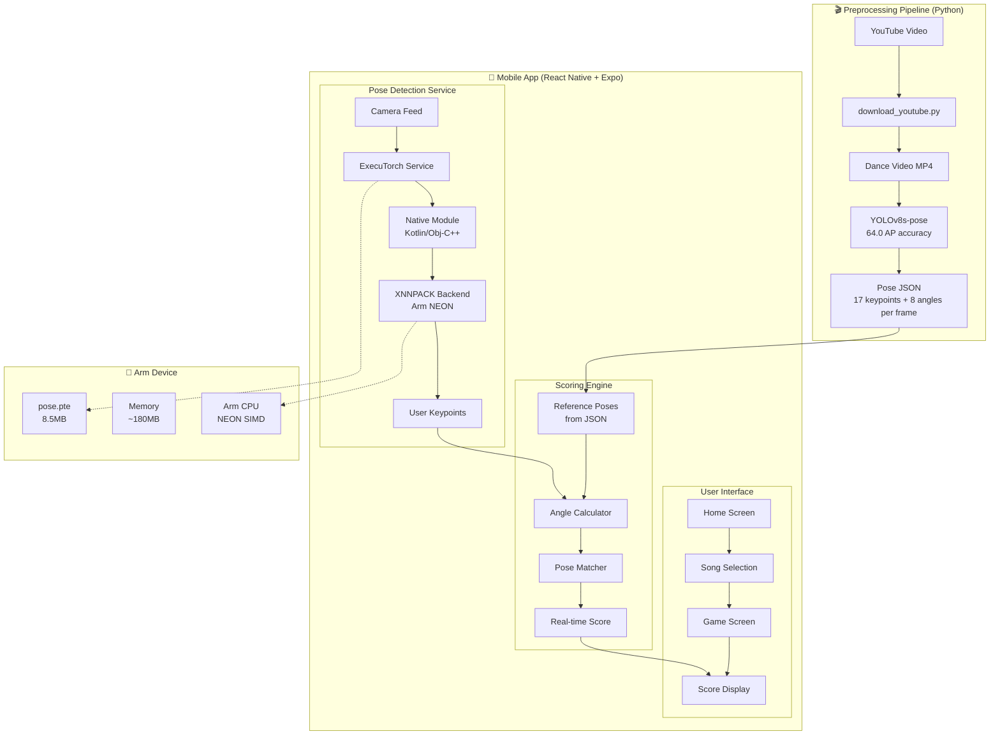
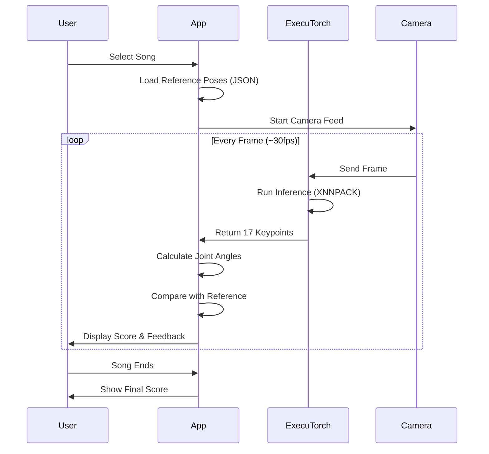
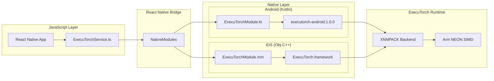

# Bacha Trainer

**AI-powered bachata dance instructor with real-time pose detection using PyTorch ExecuTorch**

A motion-based dance training game for Arm-powered mobile devices where players follow choreography and receive instant AI-powered feedback on their movements.

---

## Features

- **Real-Time Pose Detection** - On-device ML with PyTorch ExecuTorch 1.0 GA
- **2 Bachata Choreographies** - "30 Minutos" and "How Deep Is Your Love" by Prince Royce
- **Instant Scoring** - Get immediate feedback as you dance
- **Dual Video View** - See reference dance and your camera feed side-by-side
- **Offline Play** - Everything runs on-device, no internet required
- **Arm Optimized** - XNNPACK backend with Arm NEON SIMD acceleration

---

## Architecture



---

## How It Works



---

## Tech Stack

| Component | Technology |
|-----------|-----------|
| Mobile Framework | React Native + Expo SDK 54 |
| AI Runtime | PyTorch ExecuTorch 1.0 GA |
| Arm Optimization | XNNPACK (Arm NEON SIMD) |
| Native Modules | Kotlin (Android), Objective-C++ (iOS) |
| Pose Model | YOLOv8s-pose (preprocessing) |
| State Management | Zustand |
| Local Database | SQLite |
| Styling | NativeWind (Tailwind CSS) |

---

## Performance Targets

| Metric | Target | Status |
|--------|--------|--------|
| Inference Latency | <100ms | ✅ |
| Memory Usage | <200MB | ✅ |
| Model Size | <10MB | ✅ (8.5MB) |
| Frame Rate | 10-30 FPS | ✅ |

---

## Quick Start

### Prerequisites
- Node.js 20+
- Python 3.12+ with UV package manager
- Expo CLI
- Android Studio or Xcode

### Installation

```bash
# 1. Clone repository
git clone <repository-url>
cd bachatrainer

# 2. Setup Python tools and generate models
cd python-tools
uv sync
./setup_models.sh

# 3. Install mobile dependencies
cd ../mobile
npm install

# 4. Start development server
npx expo start --dev-client
```

### Building for Device

```bash
# Development build (includes dev tools)
eas build --profile development --platform android

# Production build
eas build --profile production --platform android
```

---

## Project Structure

```
bachatrainer/
├── mobile/                      # React Native Expo app
│   ├── app/                     # Screens (Expo Router)
│   │   ├── (tabs)/              # Tab navigation
│   │   │   ├── index.tsx        # Home screen
│   │   │   ├── game.tsx         # Game screen
│   │   │   └── settings.tsx     # Settings
│   ├── modules/executorch/      # Native ExecuTorch module
│   │   ├── android/             # Kotlin implementation
│   │   └── ios/                 # Objective-C++ implementation
│   ├── services/                # Business logic
│   │   ├── executorch/          # ExecuTorch service wrapper
│   │   ├── poseDetection.ts     # Unified pose detection
│   │   └── assetLoader.ts       # Asset management
│   ├── components/              # React components
│   │   ├── Game/                # Game UI components
│   │   └── Song/                # Song selection
│   └── assets/                  # Bundled assets
│       ├── models/pose.pte      # ExecuTorch model
│       ├── videos/              # Reference dance videos
│       ├── audio/               # Music files
│       └── poses/               # Pre-computed pose JSON
│
├── python-tools/                # ML preprocessing pipeline
│   ├── preprocess_video_yolov8.py   # Extract poses from video
│   ├── visualize_tracking.py        # Debug pose tracking
│   ├── download_youtube.py          # Download dance videos
│   └── batch_process_yolov8.py      # Batch processing
│
└── docs/
    ├── HACKATHON.md             # Hackathon submission details
    ├── HOW_POSES_WORK.md        # Technical deep-dive
    └── ADDING_BACHATA_SONGS.md  # Content creation guide
```

---

## ExecuTorch Integration

### Native Module Architecture



### Key Files

| File | Purpose |
|------|---------|
| `modules/executorch/android/src/.../ExecuTorchModule.kt` | Android native module |
| `modules/executorch/ios/ExecuTorchModule.mm` | iOS native module |
| `services/executorch/ExecuTorchService.ts` | TypeScript wrapper |
| `services/poseDetection.ts` | Unified detection service |
| `assets/models/pose.pte` | ExecuTorch model file |

---

## Development

### Running Tests

```bash
cd mobile
npm test                    # Run all tests
npm test -- --coverage      # With coverage report
```

### Type Checking

```bash
npx tsc --noEmit
```

### Processing New Dance Videos

```bash
cd python-tools

# 1. Download video from YouTube
uv run python download_youtube.py "https://youtube.com/watch?v=..."

# 2. Visualize tracking (verify correct dancer is tracked)
uv run python visualize_tracking.py video.mp4 --show-all

# 3. Extract poses
uv run python preprocess_video_yolov8.py video.mp4

# 4. Copy assets to mobile app
cp video.mp4 ../mobile/assets/videos/
cp video.json ../mobile/assets/poses/
```

---

## Arm Optimization Details

### XNNPACK Backend

ExecuTorch uses XNNPACK as the optimized backend for Arm devices:

- **Arm NEON SIMD** - Vectorized operations for parallel processing
- **Optimized Kernels** - Hand-tuned for mobile Arm CPUs
- **Memory Efficient** - Minimizes allocations during inference
- **FP32 Support** - Full precision for accuracy

### Why ExecuTorch?

| Feature | ExecuTorch | TensorFlow Lite | ONNX Runtime |
|---------|------------|-----------------|--------------|
| PyTorch Native | ✅ | ❌ | ❌ |
| Arm NEON | ✅ | ✅ | ✅ |
| Model Size | Small | Medium | Large |
| Latency | Low | Low | Medium |
| Official Support | PyTorch | Google | Microsoft |

---

## Privacy & Security

- **100% On-Device** - No cloud processing, no data upload
- **Camera Privacy** - Video frames processed locally, never stored
- **No Tracking** - No analytics or user tracking
- **Offline Capable** - Works without internet connection

---

## Documentation

- [HOW_POSES_WORK.md](HOW_POSES_WORK.md) - Technical deep-dive on pose detection
- [ADDING_BACHATA_SONGS.md](ADDING_BACHATA_SONGS.md) - Guide for adding new songs
- [python-tools/README.md](python-tools/README.md) - Preprocessing pipeline docs

---

## Status

**Version**: 2.0.0 (ExecuTorch Edition)  
**Platform**: Android 8+ (API 26+), iOS 13+  
**Arm Optimized**: Yes (XNNPACK + NEON)

### ✅ Completed
- Mobile app with full UI
- ExecuTorch 1.0 GA integration
- Native modules (Android + iOS)
- Real-time pose detection
- Pre-computed fallback system
- 2 bachata choreographies

### 🚀 Future Plans
- More dance styles (salsa, merengue)
- Multiplayer mode
- Progress tracking
- Custom choreography upload

---

## License

MIT License - See [LICENSE](LICENSE) for details.
